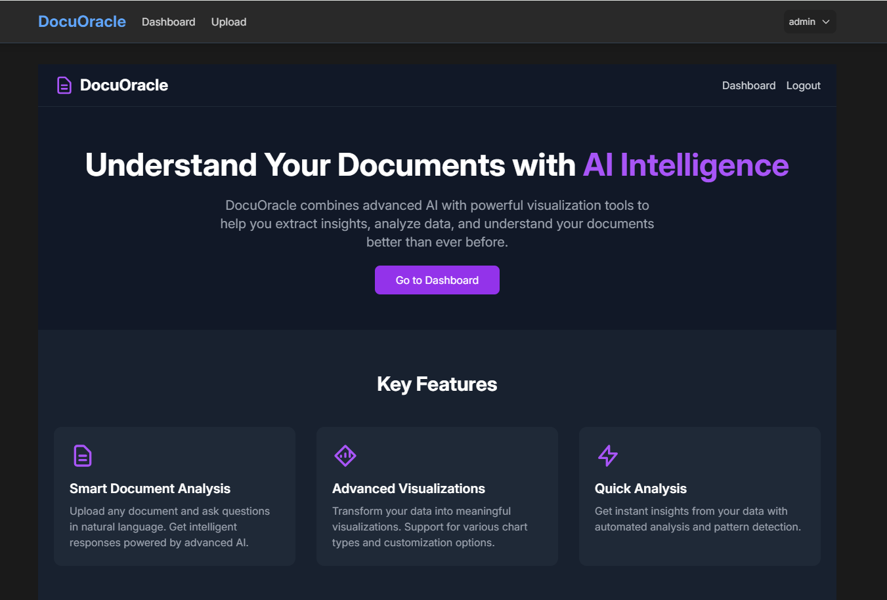

# 🔮 DocuOracle

[](https://www.python.org/downloads/)
[](https://flask.palletsprojects.com/)
[](LICENSE)

> An AI-powered document analysis and visualization platform with advanced RAG (Retrieval-Augmented Generation) support.

<div align="center">
    
    <p><em>DocuOracle's modern and intuitive interface for document analysis</em></p>
</div>

## ✨ Overview

DocuOracle is an advanced document analysis platform that combines the power of AI with intuitive visualization tools. Process various document formats, ask questions in natural language, and get intelligent insights from your data.

### 📑 Document Analysis
- **Multi-Format Support**: Process PDF, DOCX, XLSX, CSV files seamlessly
- **RAG Integration**: Advanced question-answering using context-aware AI
- **Smart Analysis**: Intelligent document parsing and understanding
- **Real-time Processing**: Quick and efficient document processing

### 📊 Data Visualization
- **Interactive Charts**: Dynamic visualization using Plotly
- **Multiple Chart Types**: Line, Bar, Scatter, Pie charts, and more
- **Customizable Themes**: Dark/Light mode support
- **Export Options**: Download visualizations in various formats

### 🤖 AI Features
- **Context-Aware Responses**: Using state-of-the-art RAG technology
- **Intelligent Extraction**: Smart data and insight extraction
- **Natural Language Processing**: Ask questions in plain English
- **Auto-Analysis**: Automated data pattern recognition

## 💻 Interface

<div align="center">
    <table>
        <tr>
            <td align="center">
                <strong>Homepage</strong><br>
                
            </td>
            <td align="center">
                <strong>Upload page</strong><br>
                
            </td>
        </tr>
    </table>
</div>

## 🚀 Quick Start

### Prerequisites
```bash
# Create and activate virtual environment
python -m venv .venv
source .venv/bin/activate  # On Windows: .venv\Scripts\activate

# Install dependencies
pip install -r requirements.txt
```

### Environment Setup
```bash
# Create .env file with required variables
cp .env.example .env

# Configure your environment variables:
FLASK_APP=run.py
FLASK_ENV=development
SECRET_KEY=your-secret-key
HF_TOKEN=your-huggingface-token
```

### Running the Application
```bash
# Initialize database
flask db init
flask db migrate
flask db upgrade

# Run the application
flask run
```

Visit `http://localhost:5000` in your browser to start using DocuOracle.

## 📊 Features in Action

### 1. Document Upload and Analysis
- Drag and drop or select files for upload
- Automatic format detection
- Real-time processing status
- Smart content extraction

### 2. Intelligent Querying
- Natural language questions
- Context-aware responses
- Reference highlighting
- Source verification

### 3. Data Visualization
- Interactive charts
- Multiple visualization types
- Custom theming
- Export capabilities

## 🔧 Configuration

### Model Configuration
```python
MODEL_PROVIDER=hf_space
RESOURCES_LIMITED=true
MODEL_DEPLOYMENT=production
```

### RAG Configuration
```python
RAG_CHUNK_SIZE=500
RAG_CHUNK_OVERLAP=50
RAG_TOP_K=3
RAG_MODEL=facebook/opt-350m
```

## 🤖 LLaMA Implementation

### Model Architecture


### LLaMA Features

#### 🔄 Dual Processing Modes
- **Traditional Processing**: Direct document-to-answer pipeline
- **RAG (Retrieval-Augmented Generation)**: Context-aware processing with document chunking and retrieval

#### 🎯 Specialized Analysis
- Document Q&A with context preservation
- Data analysis with statistical insights
- Excel data processing with automated summaries

#### 🛠 Model Configuration
```python
# Default RAG Configuration
RAG_CHUNK_SIZE = 500
RAG_CHUNK_OVERLAP = 50
RAG_TOP_K = 3
RAG_MODEL = "facebook/opt-350m"
RAG_EMBEDDINGS_MODEL = "sentence-transformers/all-MiniLM-L6-v2"
```

#### 💪 Key Features
- **Auto Model Selection**: Intelligent model choice based on resource requirements
- **GPU Acceleration**: Automatic CUDA detection and utilization
- **Batch Processing**: Optimized for handling multiple requests
- **Error Handling**: Comprehensive error management and logging
- **Resource Management**: Adaptive resource allocation based on system capabilities

### Model Providers
- **Local**: Local LLaMA model deployment
- **Hugging Face**: Integration with Hugging Face model hub
- **API**: External API connectivity (configurable)

### Processing Pipeline

1. **Document Intake**
   ```python
   def process_document_with_rag(
       document_text: str,
       query: str,
       is_data_analysis: bool = False
   ) -> Dict[str, Union[bool, str, dict]]
   ```

2. **Text Chunking**
   - Recursive character splitting
   - Configurable chunk size and overlap
   - Context preservation

3. **Embedding Generation**
   - Sentence transformer encoding
   - FAISS vector store integration
   - Similarity-based retrieval

4. **Response Generation**
   - Context-aware responses
   - Format-specific handling (Document/Data)
   - Statistical analysis for data queries

### Performance Optimization

#### Resource Management
- Automatic GPU detection
- Batch size optimization
- Concurrent request handling

#### Memory Efficiency
- Streaming response generation
- Efficient vector storage
- Chunk management

### Usage Examples

#### Initialize RAG System
```python
from docuoracle_app.llama_handler import initialize_rag

requirements = {
    'deployment': 'production',
    'resources': 'limited'
}
success, message = initialize_rag(requirements)
```

#### Process Documents
```python
from docuoracle_app.llama_handler import process_document_with_rag

result = process_document_with_rag(
    document_text="Your document content",
    query="Your question",
    is_data_analysis=False
)
```

#### Analyze Data
```python
from docuoracle_app.llama_handler import analyze_excel_data

result = analyze_excel_data(
    df=your_dataframe,
    query="What are the key trends?"
)
```

### Error Handling

The system implements comprehensive error handling:
- Input validation
- Model state verification
- Resource availability checks
- Process monitoring
- Detailed error logging

### Configuration Options

```python
@dataclass
class RAGConfig:
    llm_model: str = "facebook/opt-350m"
    embedding_model: str = "sentence-transformers/all-MiniLM-L6-v2"
    provider: ModelProvider = ModelProvider.HUGGINGFACE_SPACE
    device: str = "cuda" if torch.cuda.is_available() else "cpu"
    batch_size: int = 8
    concurrent_requests: int = 4
    temperature: float = 0.7
    max_length: int = 512
```

## 🛡️ Security Features
- CSRF Protection
- Secure File Handling
- User Authentication
- Session Management
- Rate Limiting
- Input Validation

## 📚 API Documentation

### Authentication
```http
POST /api/login
Content-Type: application/json

{
    "username": "user",
    "password": "password"
}


### Document Operations
```http
# Upload Document
POST /api/documents

# Get Document
GET /api/documents/{id}

# Process Document
POST /api/query
```

## 🤝 Contributing

1. Fork the repository
2. Create your feature branch (`git checkout -b feature/AmazingFeature`)
3. Commit your changes (`git commit -m 'Add some AmazingFeature'`)
4. Push to the branch
5. Open a Pull Request

## 📝 License

This project is licensed under the MIT License 

## 🙏 Acknowledgments

- Built with [Flask](https://flask.palletsprojects.com/)
- UI powered by [TailwindCSS](https://tailwindcss.com/)
- Charts by [Plotly](https://plotly.com/)
- RAG implementation using [HuggingFace](https://huggingface.co/)


---

<div align="center">
   
    © 2024 DocuOracle
</div>